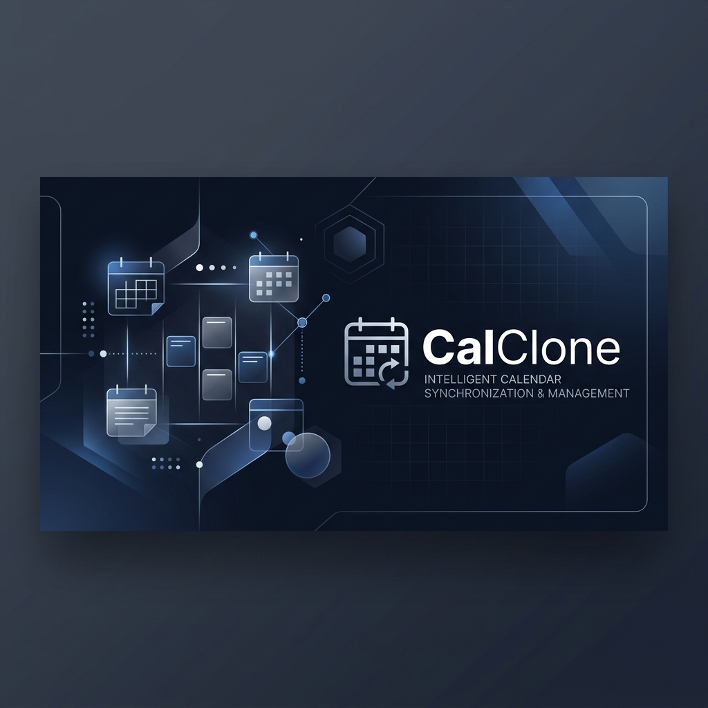
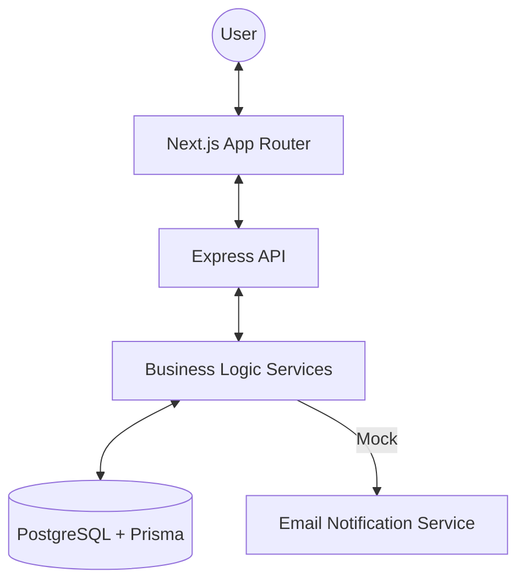
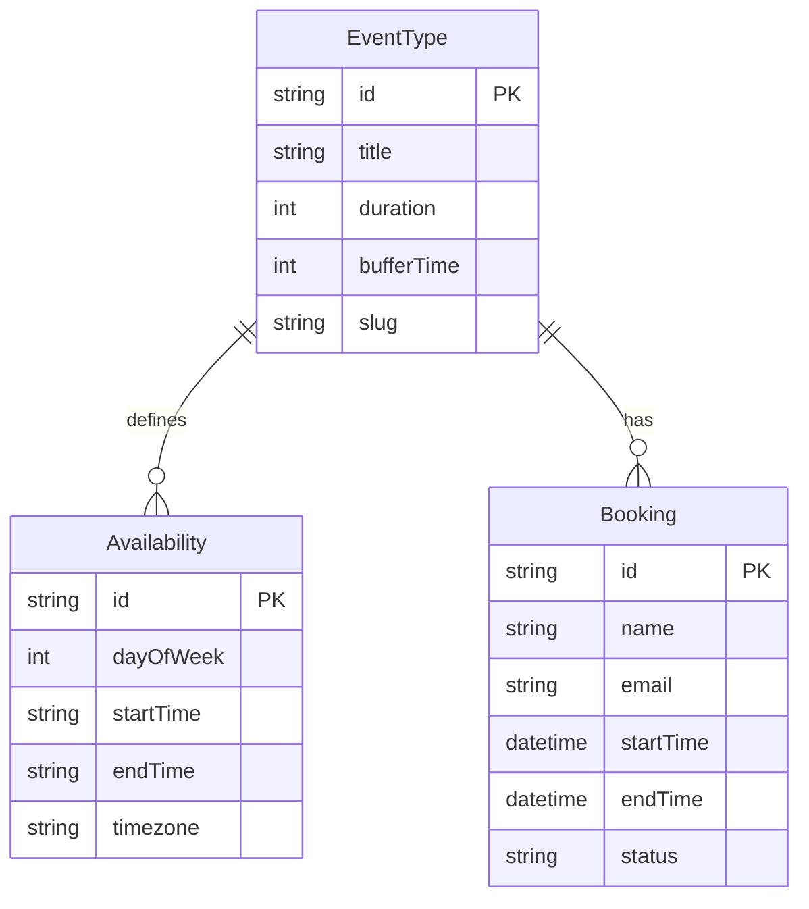

<p align="center">
  
</p>

<h1 align="center">CalClone</h1>

<p align="center">
  A high-fidelity, open-source scheduling infrastructure inspired by Cal.com. Built for speed, reliability, and global timezone synchronization.
</p>

<p align="center">
  
  
  
  
</p>

---

## 🌟 Overview

CalClone is a production-ready scheduling engine that solves the complex problem of cross-timezone availability and atomic booking management. Gone are the days of manual time zone calculations and "Oops, I'm double booked."

### Key Highlights
- **💨 Blazing Fast**: Next.js App Router for instant page transitions.
- **🌍 Global by Default**: Native `date-fns-tz` integration ensures slots are flawless across all continents.
- **🔒 Atomic Integrity**: Prisma transactions prevent race conditions during booking and availability updates.
- **🎨 Minimalist Aesthetic**: Modeled after Cal.com's premium design tokens for a professional SaaS feel.

---

## 🛠 Features

### 📅 Event Management
Create specialized scheduling pages for 15m, 30m, or 60m meetings. Customize durations, descriptions, and permanent URL slugs.

### 🕐 Intelligent Availability
Define your weekly schedule per event type. Set specific windows (e.g., 09:00 - 17:00) and let CalClone handle the slot generation logic, including **buffer times** between meetings.

### 🚀 Public Booking Flow
A friction-less experience for your guests. 
- **Calendar View**: High-contrast, interactive calendar.
- **Dynamic Slotting**: Only shows real-time available windows.
- **Instant Confirmation**: Automatic "mock" email notifications for both host and guest.

### 📋 Pro Dashboard
Manage your schedule like a pro. Track upcoming sessions, view history, and cancel appointments with one click.

### 🔄 Rescheduling (Bonus)
Specialized one-time use links that allow users to move their appointment without the manual back-and-forth.

---

## 🏗 System Architecture



### Database Schema


---

## 🚀 Installation & Setup

### 1. Prerequisites
- **Node.js**: 18.x or higher
- **PostgreSQL**: Local instance running

### 2. Backend Setup
```bash
cd server
npm install
# Configure DATABASE_URL in .env
npx prisma migrate dev
npx prisma db seed
npm run dev
```

### 3. Frontend Setup
```bash
cd client
npm install
# Configure NEXT_PUBLIC_API_URL in .env.local
npm run dev
```

---

## 🧪 Technical Excellence

- **Pure Arithmetic Slotting**: Slot generation uses a custom minute-based algorithm to avoid the common "Date object traps" in JavaScript.
- **UTC-First Persistence**: All timestamps are normalized to UTC in the database, ensuring absolute truth regardless of server location.
- **Soft-Delete Lifecycle**: Bookings are never truly destroyed; they follow a state-machine (CONFIRMED -> CANCELLED) to preserve data history.

---

<p align="center">
  Built with ❤️ for the Scaler SDE Intern Fullstack Assignment.
</p>
